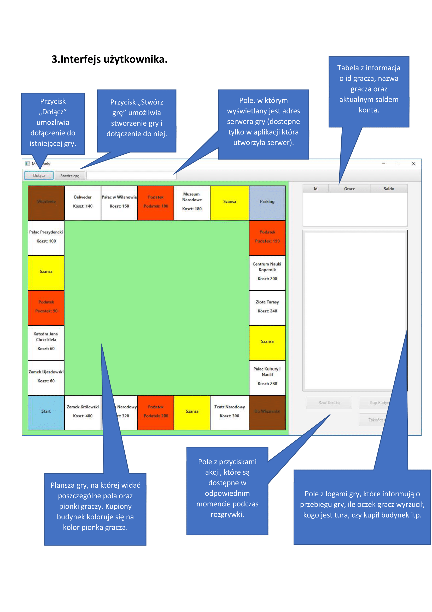

# SimpleNetworkMonopolyJavaFX
_Aplikacja zaimplementowana podczas zajęć_

Gra została napisany w języku **JAVA**. Do interfejsu graficznego wykorzystano **JavaFX**, natomiast do komunikacji sieciowej posłużyła biblioteka **Kryonet**.

Program jest prostą implementacją gry monopoly z możliwością grania poprzez sieć (architektura klient-serwer).

